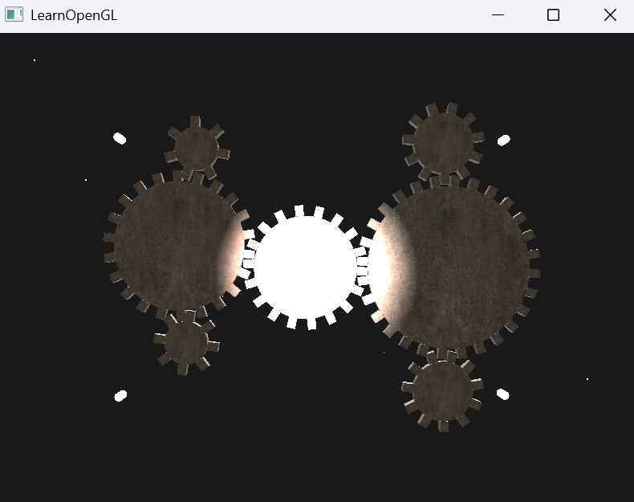

# OpenGL Multiple Lights with Starfield

This project is an **OpenGL graphics demo** that renders a set of rotating gears illuminated by multiple point lights and a background starfield.  
It is based on the LearnOpenGL framework and extended with additional lighting effects.

---

## Features
- 4 **interactive point lights** with attenuation
- 1 **spotlight** following the camera
- Randomly generated **starfield** (tiny cubes as stars)
- Copper material gears with diffuse and specular maps
- Camera controls (WASD + mouse look + scroll zoom)

---

## Controls
- **W / A / S / D** → Move camera  
- **Mouse move** → Look around  
- **Mouse scroll** → Zoom in/out  
- **ESC** → Quit program  

---

## Demo

### Screenshot


### Demo Video
![Demo Video] https://github.com/user-attachments/assets/2b4a3592-e979-48ee-8a2f-73703998c703

---

## Project Structure
```
OpenGL-graphics/
│
├── src/
│   └── multiple_lights.cpp
│
├── shaders/
│   ├── 6.multiple_lights.vs
│   ├── 6.multiple_lights.fs
│   ├── 6.light_cube.vs
│   └── 6.light_cube.fs
│
├── resources/
│   └── textures/
│       ├── copper_diffuse.png
│       ├── copper_specular.png
│       └── ...
│
├── media/
│   ├── project_result_pic.png
│   └── project_result_vdo.mp4
│
├── README.md
└── CMakeLists.txt 
```

---

## 🙏 Acknowledgements
- **LearnOpenGL** tutorials by Joey de Vries → [https://learnopengl.com](https://learnopengl.com)  
- **GLM** mathematics library → [https://github.com/g-truc/glm](https://github.com/g-truc/glm)  
- **stb_image** loader by Sean Barrett → [https://github.com/nothings/stb](https://github.com/nothings/stb)  
- **Copper PBR Material** from [FreePBR.com](https://freepbr.com/product/oxidized-copper-pbr-material/)
